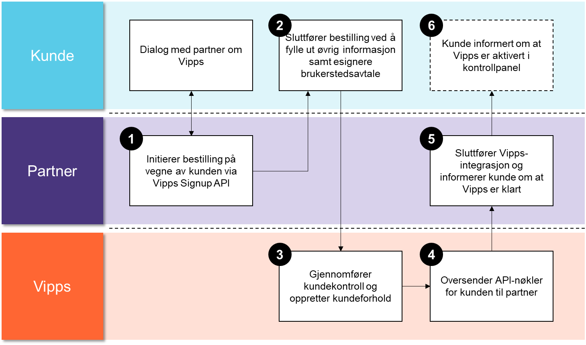
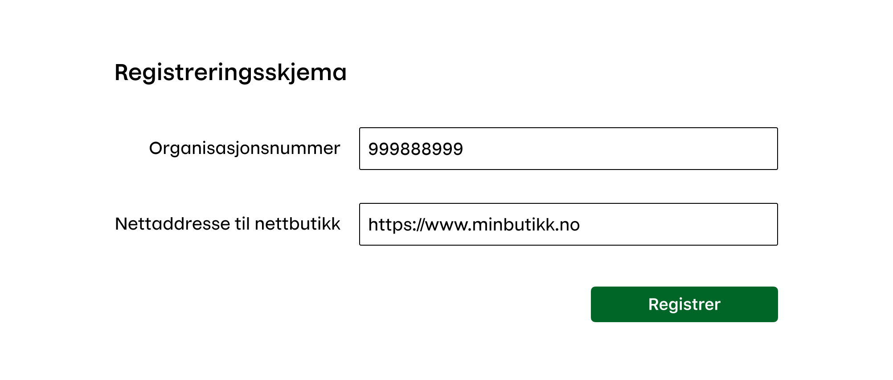
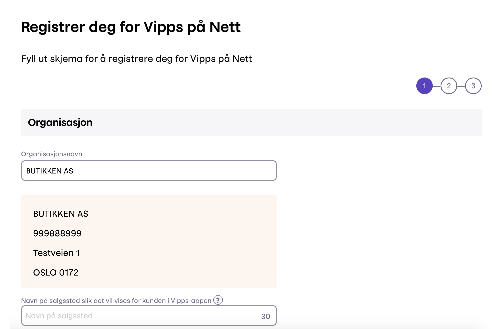

# Vipps Partner Signup API

This repository contains developer resources for the Vipps Partner Signup API.

API Documentation: https://vippsas.github.io/vipps-signup-api/

Document version 2.0.2.

## About the Vipps Partner Signup API

The Vipps Partner Signup API lets partners create signup forms for Vipps
eCommerce for their merchants. The partners can make the process simpler for
the merchant by pre-filling the form with certain data.

We are also enabling the partner to automate the reception of API keys with
the Signup callback functionality.

**Please note:** The Signup API has some dependencies that are not in place
in our test environment. Because of this we recommend to "test in prod" by
signing up yourself.

### Process overview



#### The signup form

The partner can implement a signup registration form for merchants on the
partner's website. The merchant enters their organization number and the URL
for their website in the form. When they click register, the signup is initiated.



#### Vipps signup form

The merchant is then redirected to the signup link, and can complete the
registration form on vipps.no.

When the form has been completed, and signed by the right person, Vipps and the
partner handles the rest of the process, and the partner informs the merchant
when the implementation is ready.



### Partner initiates the signup

We want to create a connection between the ecommerce partner ("Partner") and
the merchant, as the partners are having a relationship to the merchant we aim
to make it easy for the merchants to complete the commercial and technical
setup for Vipps. The process is initiated by the partner, calling Vipps API to
create a pre-filled signup form.

**Request**
```html
{
    "orgnumber" : "819226032",
    "partnerId":"1234",
    "subscriptionPackageId":"1234",
    "merchantWebsiteUrl": "https://www.vipps.no",
    "signupCallbackToken":"",
    "signupCallbackUrl":"https://upload.credentials.to.partner.url",
    "form-type":"vippspanett"
}
```
### Partner receives the signup link

As response to partial signup initiation above the partner receives an signup
id and a link to the signup which is forwarded to the merchant to complete the
registration.

**Response**
```html
{
    "signup-id": "4188dea2-00d0-488a-88b7-b39b186151c0",
    "vippsURL": "https://vippsbedrift.no/signup/vippspanett/?r=4188dea2-00d0-488a-88b7-b39b186151c0"
}
```

Please note that the link is valid for 30 days only.
If the signup link has expired, it will give an error: "Agreement not found".
The fix is to simply initiate a new signup.

### The signup form, KYC and signing process

Merchant completes the form and if necessary answers additional questions as
part of the Vipps KYC process.  

### The signup callback

Once Vipps have completed the registration the signup callback is initiated to
the partner `signupCallbackUrl` with the required API credentials for the merchant.

Vipps expects a `HTTP 200 OK` response for the callback.

If the partner is unable to receive the callback, or the callback fails for
some reason, the merchant can log in with BankID on portal.vipps.no and
retrieve the API keys as described in
[Getting started](https://github.com/vippsas/vipps-developers/blob/master/vipps-getting-started.md).

## Additional developer resources

See the the main developer page: https://github.com/vippsas/

## Questions?

We're always happy to help with code or other questions you might have!
Please create an [issue](https://github.com/vippsas/vipps-signup-api/issues),
a [pull request](https://github.com/vippsas/vipps-signup-api/pulls),
or [contact us](https://github.com/vippsas/vipps-developers/blob/master/contact.md).

Sign up for our [Technical newsletter for developers](https://github.com/vippsas/vipps-developers/tree/master/newsletters).
